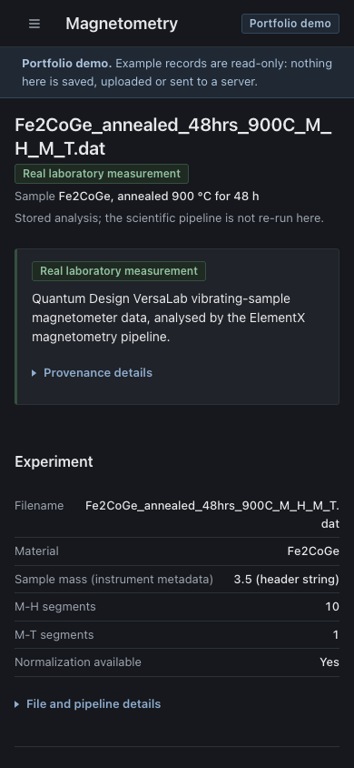

# ElementX

ElementX is a research tool for **magnetic-materials** data. It reads Quantum Design VSM magnetometry
files and XRD patterns, runs a documented analysis pipeline on a backend, stores each result with its
provenance, and lets you explore the stored values in interactive plots.

> **Live demo:** _URL to be added after the static demo is deployed_ <!-- DEMO_URL -->
> A read-only **portfolio demo** (no sign-in, no backend) with a real Fe2CoGe VSM measurement.
> See [`docs/DEMO.md`](docs/DEMO.md).


## Features

- **Magnetometry** (Quantum Design `.dat`): file segmentation into M-H loops and M-T sweeps, hysteresis
  values (Hc, Mr), high-field slope diagnostics, mass-normalised values with explicit mass provenance.
- **Interactive plots**: zoom by dragging, explicit axis ranges, loop switching by temperature, enlarge,
  and export of the measured points (CSV) and the figure (SVG).
- **XRD** (two-column text): measured pattern and *candidate intensity maxima* only (see
  [scientific notes](#scientific-correctness-notes)).
- **Samples**: group saved experiments per sample; stored analyses are re-opened without re-running the
  pipeline.
- **Materials Explorer**: element masses and Materials Project lookups by formula.
- **Physics Copilot**: answers grounded in your stored records. With a Gemini key it can write prose;
  without one it prints a labelled readout of the stored values. The two are always labelled differently.
- Dark and light themes, keyboard-accessible controls, responsive down to phone width.

| Magnetometry (dark) | M-H loop (light) |
|---|---|
|  |  |

| Synthetic XRD, labelled as such (light) | Stored-record Copilot readout (dark) |
|---|---|
|  |  |



## Portfolio demo

The demo is the same frontend with `VITE_DEMO_MODE=true`. It is **static**: the browser loads JSON
snapshots of what the real backend returned for two bundled files, and never contacts a server.

- **Real:** Fe2CoGe, annealed 900 °C for 48 h: ten M-H loops and one M-T sweep (VersaLab VSM).
- **Synthetic:** a hand-written XRD test pattern, labelled *not a laboratory measurement* wherever it
  appears.
- **Reference data:** a few Materials Project entries (CC BY 4.0), with the retrieval date shown.
- **Copilot:** recorded stored-record readouts. No language model runs.

**Limitations.** Example records are read-only. Sign-in, registration, creating or saving samples, file
uploads, live Gemini and live Materials Project queries are switched off and their controls are not
shown. Nothing is sent to a server; no API key or database connection is shipped.

Run it locally (no backend needed):

```bash
cd frontend/elementx-frontend
npm install
npm run dev:demo          # http://localhost:5173/
```

## Architecture

```
                       full application                                   portfolio demo (static)

Browser (React 19, Vite)                                          Browser (same frontend, demo mode)
   │  Bearer JWT                                                     │  fetch static JSON only
   ▼                                                                 ▼
FastAPI backend ── services/: parsers, magnetometry_analysis,    public-demo/demo/*.json
   │               xrd_analysis, mass_normalization, ...             ▲
   ├── SQLite + original files  (research records)                   │ generated by
   └── MongoDB or local store   (accounts)                           │ backend/scripts/build_demo_data.py
                                                                     └── drives the real FastAPI routes
```

- **The backend does the science; the frontend only displays it.** The browser performs no physics
  and never recomputes a stored value.
- Experiments are stored with their original file and the full analysis JSON, tagged with the pipeline
  version. Re-opening one shows the stored result.
- Demo snapshots are produced by running the real routes against a throw-away database. They are not
  hand-written. See [`docs/DEMO.md`](docs/DEMO.md) for provenance and redaction.

## Tech stack

| Layer | Technology |
|---|---|
| Frontend | React 19, TypeScript, Vite 7, Recharts |
| Backend | FastAPI, Pydantic, SQLAlchemy (SQLite), NumPy, SciPy |
| Materials data | `mp-api` / Materials Project, `pymatgen` (CIF) |
| Accounts | MongoDB, or a local store for development; JWT bearer auth |
| Optional AI | Gemini for Copilot prose (off by default) |
| Hosting | Render (see [`docs/PRODUCTION.md`](docs/PRODUCTION.md); demo: `render.demo.yaml`) |

## Local setup (full application)

```bash
# backend
cd backend
python -m venv venv && source venv/bin/activate
pip install -r requirements.txt -c constraints.txt
# optional, in a git-ignored .env at the repo root or backend/: MP_API_KEY, GEMINI_API_KEY, MONGODB_URI, JWT_SECRET
uvicorn main:app --reload                # http://localhost:8000/docs

# frontend (separate terminal)
cd frontend/elementx-frontend
npm install
npm run dev                              # http://localhost:5173/ (proxies /api to :8000)
```

Without MongoDB the backend runs in a local development mode. Production configuration, persistence
and backups are described in [`docs/PRODUCTION.md`](docs/PRODUCTION.md) and
[`docs/BACKUP_AND_RECOVERY.md`](docs/BACKUP_AND_RECOVERY.md). Never commit `.env`; keys are read on the
server and are not exposed to the browser.

## Testing

```bash
# backend (includes the demo-snapshot reproducibility check)
cd backend && python -m unittest discover -s tests -t .

# demo snapshots: re-run the real pipeline and compare, writing nothing
cd backend && python -m scripts.build_demo_data --check

# frontend
cd frontend/elementx-frontend
npx tsc -b && npm run lint
npm run check:contrast     # WCAG contrast for every text/background pair in both themes
npm run check:copilot      # stored-record parser (113 checks)
npm run check:demo         # snapshot hashes, redaction, synthetic labelling
npm run build:demo         # demo build + bundle credential scan
VITE_API_URL=https://api.example.com npm run build:production   # production build + guards
```

## Scientific-correctness notes

- **The largest measured |M| is never called saturation magnetization.** It is reported as "largest
  measured moment", with a separate high-field *evidence* label that states the quality of the
  high-field data, not a determination that the sample is saturated.
- **No Curie temperature** is calculated. M-T segments are plotted for identification only.
- **XRD maxima are candidate intensity maxima only**: local maxima from the peak finder, not assigned
  to a phase, hkl, lattice parameter or crystallite size.
- **Mass normalisation is explicit.** The mass used, where it came from (instrument header, filename
  hint, or user confirmation) and whether sources disagree are stored with the result. Normalised values
  are only produced when a mass is resolved.
- **Provenance travels with the data.** Records carry the analysis version; demo records also carry the
  SHA-256 of the source file and a list of any modifications to the public copy.
- **Synthetic data is labelled.** The demo XRD pattern is a software test fixture and is marked as such
  in the sample name, the notes, the provenance panel and the experiment header.
- The Copilot is told only the stored values. A stored-record readout is shown as a readout; text from a
  language model is shown as model output and is not parsed as scientific data.

## Project layout

```
backend/
  main.py                      FastAPI app (legacy routes plus research API)
  routers/research*.py         samples, experiments, Physics Copilot
  services/                    parsers, analysis pipelines, storage, Materials client
  scripts/build_demo_data.py   generates and verifies the demo snapshots
  tests/                       unit and API tests (fixtures in tests/fixtures)
frontend/elementx-frontend/
  src/components/              Samples, Magnetometry, XRD, Materials, Copilot, shell
  src/demo/                    demo-only code (landing, provenance, snapshot loader)
  public-demo/demo/            static demo snapshots (demo builds only)
docs/                          production, backup and demo guides, screenshots
render.yaml                    production blueprint
render.demo.yaml               static-site blueprint for the demo
```

The earlier MnAl-oriented sample, stoichiometry and dopant-ranking endpoints remain in the backend but are
not part of the research workflow described above.

## Data and licences

Materials Project data are licensed [CC BY 4.0](https://creativecommons.org/licenses/by/4.0/). The example
magnetometry measurement was approved by its owner for the public demo; the demo publishes only derived
results, with instrument serial numbers removed (see [`docs/DEMO.md`](docs/DEMO.md)).

## Author

Manish Neupane, SDSU (CS + Physics). Portfolio: [mneupane.com](https://mneupane.com)
