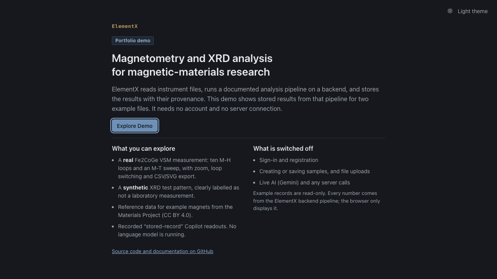
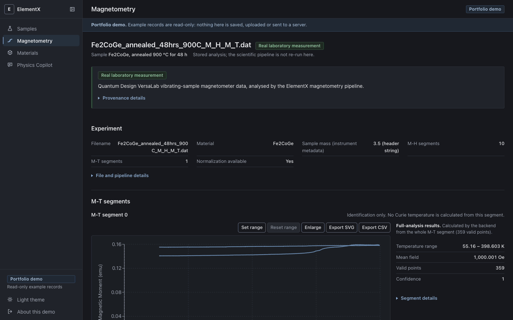
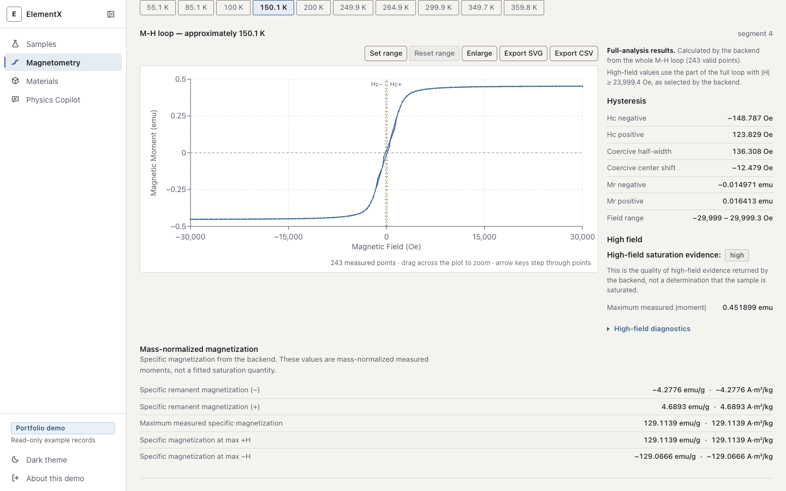
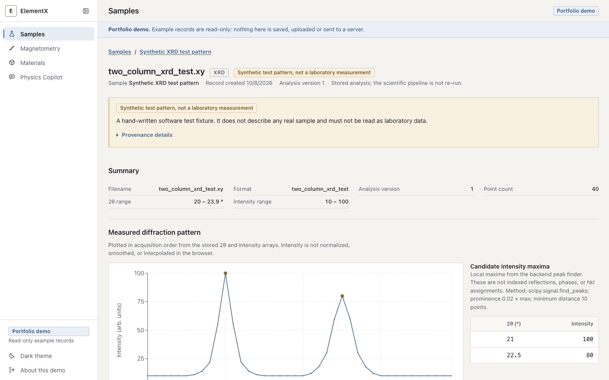
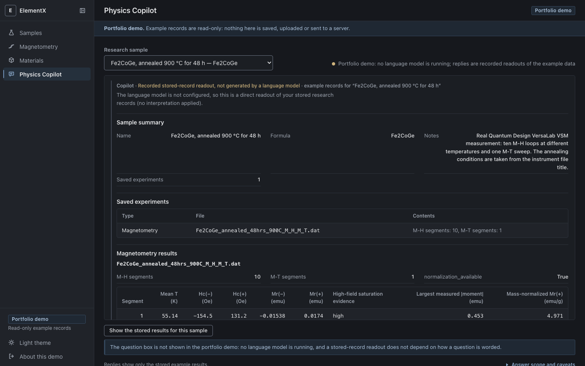

# ElementX

ElementX is a scientific research and analysis platform for experimental materials science. It reads
instrument files (Quantum Design magnetometry, XRD patterns), runs a documented analysis pipeline in
Python, and stores every result with the provenance needed to trust it. A React/TypeScript front end
renders the stored results as interactive plots and tables.

**Live demo: [elementx-frontend.onrender.com](https://elementx-frontend.onrender.com)**
(a static, read-only portfolio demo: no sign-in, no backend, a real Fe2CoGe measurement)

Core technologies: Python, FastAPI, NumPy, SciPy, SQLAlchemy/SQLite, pymatgen and the Materials Project
API on the back end; React 19, TypeScript, Vite and Recharts on the front end.



| Magnetometry analysis (dark theme) | Interactive hysteresis loop (light theme) |
|---|---|
|  |  |

| Synthetic XRD demonstration (light theme) | Physics Copilot, recorded readout (dark theme) |
|---|---|
|  |  |

## What ElementX does

The table separates the complete application from the public static demo, so neither is read as the
other.

| Capability | Complete application (run locally or self-hosted) | Public demo |
|---|---|---|
| Accounts and sign-in (JWT) | Yes | No. There is no sign-in. |
| Upload a Quantum Design `.dat` file and analyse it | Yes | No. Uploads are disabled. |
| Upload an XRD pattern and detect candidate maxima | Yes | No. Uploads are disabled. |
| Save samples and experiments, re-open them later | Yes (SQLite plus the original files) | No. Two read-only example samples. |
| M-H and M-T plots, loop switching, zoom, CSV/SVG export | Yes | Yes, for the example measurement |
| Hc, Mr, high-field diagnostics, mass-normalised values | Computed by the backend on upload | Shown from stored backend output |
| Mass provenance and normalisation checks | Yes | Shown from stored backend output |
| Materials Project lookup by formula | Live query (needs an API key) | Four curated entries, retrieved on 2026-10-08 |
| CIF structure parsing | Yes | No |
| Physics Copilot | Grounded in the signed-in user's stored records. Optional Gemini prose; otherwise a labelled readout of the stored values. | Recorded stored-record readouts only. No language model runs and no free-text questions. |

## Capabilities in detail

- **Quantum Design magnetometry parsing.** Reads the VersaLab/MultiVu `.dat` header and data columns
  (temperature, field, moment) without unit conversion, and splits the file into measurement segments.
  Segments are classified as M-H (field sweep at roughly fixed temperature), M-T (temperature sweep at
  roughly fixed field) or unknown, from relative behaviour rather than file names or absolute setpoints.
- **M-H analysis.** Branch-aware coercivity (Hc) and remanence (Mr), taken from the original sweep
  order; the data is never sorted by field. Values stay in instrument units (Oe, emu) and each carries
  the bracket it was interpolated from. For the example file the app shows ten loops between 55 K and
  360 K.
- **High-field diagnostics.** The largest measured moment, linear fits to the positive and negative
  high-field regions, and a heuristic *saturation-evidence* label. The fit intercept is a diagnostic
  extrapolation and is not reported as a saturation magnetization.
- **M-T segments.** Plotted and identified. No transition temperature is computed from them.
- **Provenance and mass normalisation.** The sample mass is resolved from the instrument header, any
  filename hint and an optional user confirmation. If sources disagree, the backend refuses to pick one
  and blocks normalisation until a human confirms the mass. Every candidate mass is kept with its source.
  Specific magnetization is produced only when normalisation is authorised.
- **XRD.** Reads two-column 2θ/intensity text and plots the measured pattern as acquired. Candidate
  intensity maxima come from `scipy.signal.find_peaks` (prominence 0.02 × maximum, minimum distance 10
  points); the method and parameters are shown beside the table.
- **Materials Project integration (complete application).** Formula lookup through `mp-api` returns the
  lowest energy-above-hull entry with its magnetic moment, ordering and symmetry. CIF files are parsed
  with pymatgen. The API key is read on the server and is never sent to the browser.
- **Physics Copilot.** Answers are grounded in the stored records of the selected sample. When a
  language model is configured it writes prose from those records; when it is not, the app prints a
  readout of the stored values and labels it as such. The two cases are shown with different labels, and
  model text is never parsed as scientific data. **In the public demo, every Copilot reply is a recorded
  stored-record readout generated once with the model switched off. It is not a live Gemini response.**
- **Front end.** React 19 and TypeScript with dark and light themes, a responsive layout down to phone
  width, and plots with drag-to-zoom, explicit axis ranges, an enlarged view and CSV/SVG export.

## Architecture

```
Complete application                           Public static demo

Browser (React + TypeScript)                   Browser (same React code, VITE_DEMO_MODE=true)
   | JWT over HTTPS                               | static fetch only
   v                                              v
FastAPI backend                                public-demo/demo/*.json
   |- parsers, segmentation, M-H/XRD analysis       ^
   |- research records: SQLite + original files     | generated from verified backend results by
   |- accounts: MongoDB or local dev store          | backend/scripts/build_demo_data.py,
   '- Materials Project, optional Gemini            | which drives the real FastAPI routes
```

- **Scientific analysis lives in Python/FastAPI.** The browser performs no physics and does not
  recompute stored values.
- **Demo snapshots come from the backend.** The generator runs the real routes against a throw-away
  database with fixed record ids and dates and the language model off. A `--check` mode re-runs the
  pipeline and compares every value with the committed files.
- **React renders saved results.** In demo mode the same components read the static JSON and the app
  makes no server calls; any stray call to the API client throws.
- **The authenticated application has separate persistence.** Research records (analysis JSON plus the
  original upload) go to SQLite and a data directory; accounts live in MongoDB, or a local store for
  development. The demo shares none of this.

## Scientific integrity

- The demo separates **real measurement data from synthetic test data.** The Fe2CoGe magnetometry
  record is a real VersaLab VSM measurement. The XRD pattern is a hand-written software test fixture,
  labelled "not a laboratory measurement" in its sample name, notes, header and provenance panel, and it
  is not attached to the Fe2CoGe sample.
- **The largest measured moment is not treated as saturation magnetization.** It is reported as the
  largest measured moment. High-field flatness is reported as *evidence*, not as a finding that the
  sample is saturated, and mass-normalising a measured maximum does not change what it is.
- **No Curie temperature is inferred from an arbitrary M-T segment.** M-T data is plotted for
  identification only.
- **XRD intensity maxima are not identified phases.** They are local maxima. They are not assigned to a
  phase, hkl index, lattice parameter or crystallite size.
- **Published demo data is reproducible and labelled.** Each demo record carries the SHA-256 and size of
  its source file, the pipeline version and a list of modifications. Record dates in the demo are fixed
  constants, not measurement dates.
- **Redaction is disclosed.** The published JSON omits five instrument serial-number fields from the
  metadata of the real measurement; nothing else was changed. [`docs/DEMO.md`](docs/DEMO.md) lists
  exactly what was removed and where the unmodified test fixture is.

## Testing

Counts below are from the last run on this branch.

| Check | Command | Result |
|---|---|---|
| Backend unit and API tests | `cd backend && python -m unittest discover -s tests -t .` | 430 tests pass |
| Demo snapshot reproducibility | `cd backend && python -m scripts.build_demo_data --check` | passes (also part of the 430) |
| Type check | `cd frontend/elementx-frontend && npx tsc -b` | passes |
| Lint | `npm run lint` | passes |
| Contrast (WCAG thresholds, both themes) | `npm run check:contrast` | 35 text/background pairs per theme pass |
| Stored-record parser | `npm run check:copilot` | 113 checks pass |
| Demo data integrity and redaction | `npm run check:demo` | passes |
| Demo build with bundle credential scan | `npm run build:demo` | passes |
| Production build with environment and bundle guards | `VITE_API_URL=https://api.example.com npm run build:production` | passes |

What the backend tests cover (430 in total, 21 modules): hysteresis (40), high-field saturation
diagnostics (45), mass normalisation (27), sample-mass provenance and conflict detection (76), M-H
analysis (17), segmentation and parsing (27 + 13 + 9 + 8), XRD analysis (12), and the API, ownership,
production-configuration, backup and SQLite-reliability tests, plus the demo-snapshot tests (7). Several
of them run the real Fe2CoGe fixture through the API.

Limits of this suite, stated plainly:

- There is no continuous-integration workflow in the repository; the commands above are run by hand.
- The front end has no unit-test framework. Its automated checks are the ones listed above.
- Accessibility was checked with axe-core in a headless browser (zero violations in dark and light, at
  1440 and 390 px) from a local script that is not committed. Only the contrast check is part of the
  repository.
- The secret scans are a bundle scan for credential patterns and known key values
  (`npm run check:bundle`, run by both build scripts) and a manual review of the repository history; no
  dedicated secret-scanning service is configured.

## Run it locally

Static demo (no backend needed):

```bash
cd frontend/elementx-frontend
npm install
npm run dev:demo          # http://localhost:5173/
```

Complete application:

```bash
# backend
cd backend
python -m venv venv && source venv/bin/activate
pip install -r requirements.txt -c constraints.txt
# optional, in a git-ignored .env at the repo root or backend/: MP_API_KEY, GEMINI_API_KEY, MONGODB_URI, JWT_SECRET
uvicorn main:app --reload                # http://localhost:8000/docs

# frontend (separate terminal)
cd frontend/elementx-frontend
npm install
npm run dev                              # http://localhost:5173/ (proxies /api to :8000)
```

Without MongoDB the backend runs in a local development mode. Never commit `.env`. Production
configuration, persistence and backups are in [`docs/PRODUCTION.md`](docs/PRODUCTION.md) and
[`docs/BACKUP_AND_RECOVERY.md`](docs/BACKUP_AND_RECOVERY.md). The demo is described in
[`docs/DEMO.md`](docs/DEMO.md).

## Repository layout

```
backend/
  main.py                      FastAPI app (legacy routes plus the research API)
  routers/research*.py         samples, experiments, Physics Copilot
  services/                    parsers, analysis pipelines, mass provenance, storage, Materials client
  scripts/build_demo_data.py   generates and verifies the demo snapshots
  tests/                       unit and API tests; fixtures in tests/fixtures
frontend/elementx-frontend/
  src/components/              Samples, Magnetometry, XRD, Materials, Copilot, app shell
  src/demo/                    demo-only code (landing, provenance, snapshot loader)
  public-demo/demo/            static demo snapshots (included in demo builds only)
docs/                          demo, production and backup guides; screenshots
render.yaml                    blueprint for the full application
render.demo.yaml               static-site blueprint for the demo
```

The earlier MnAl-oriented endpoints (stoichiometry, dopant ranking, synthesis-note parsing) remain in the
backend. They are not part of the research workflow above and are not shown in the demo.

## Data and licences

Materials Project data are licensed [CC BY 4.0](https://creativecommons.org/licenses/by/4.0/). The demo
shows the source, licence and retrieval date beside them. No licence file has been added to this
repository yet.

## Author

Manish Neupane, SDSU (CS + Physics). Portfolio: [mneupane.com](https://mneupane.com)
